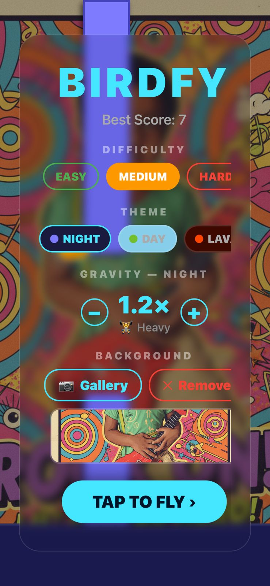
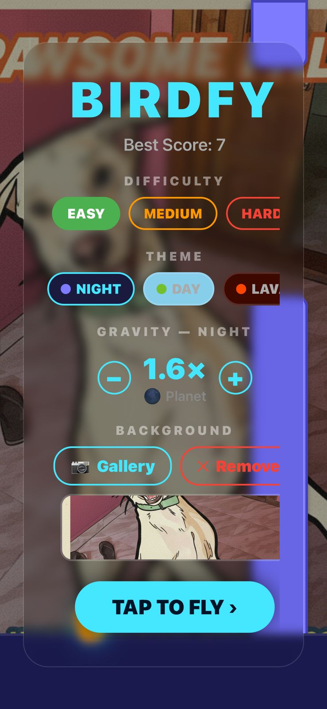
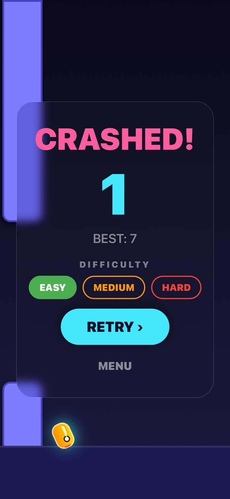

 Birdfy — From HTML Script to iOS App

> **Created by V Anbu Chelvan (ZANYANBU)**
> A tribute to Flappy Bird that evolved from a single HTML file into a full-featured iOS native game.
> Built with love for Dong Nguyen, whose brilliantly simple game inspired a generation of developers.

---

## 📸 Screenshots

| Gameplay | Main Menu | Custom Background |
|:---:|:---:|:---:|
|  |  |  |

> **To add your own screenshots:** place `.png` files in a `screenshots/` folder at the root of the repo and they will appear here automatically.

---

## 🌐 Play It Now (Web)

🔗 **Live Demo:** [https://zanyanbu.github.io/Birdfy.com/](https://deploy-preview-2--glistening-cactus-8ee814.netlify.app/)

Open `index.html` directly in any browser — **no install needed**.

---

## 🚀 The Journey: HTML → iOS

| Version | Platform | Technology | What Was Added |
|---|---|---|---|
| **v1** | Browser | HTML5 Canvas + vanilla JS | Core flappy mechanics, physics |
| **v2** | Browser | CSS3 + Web Audio API | Sci-fi theme, particle effects, sound |
| **v3** | Browser | JavaScript ES6+ | Difficulty modes, AI chat sidebar, gravity slider |
| **v4** | iOS + Android | React Native (Expo) | Native 60fps engine, haptics, themes, wings |
| **v5** | iOS + Android | Expo SDK 54 | Gallery backgrounds, per-theme gravity, animated wings |

---

## ✨ Full Feature List

### 🌐 Web Version (`index.html` / `app.js`)

- ⚡ **Pure Vanilla JS** — zero frameworks or dependencies
- 🎆 **Particle explosion** on collision (25-particle system)
- 🌌 **Animated starfield** background
- 🎨 **Sci-Fi neon glassmorphism UI**
- 🎚️ **Real-time gravity slider** per difficulty
- 🏆 **Persistent high score** via `localStorage`
- 🔊 **Procedural sound effects** using Web Audio API
- 🤖 **Optional local AI chatbot** (DeepSeek via Ollama / LM Studio)
- 📱 **Responsive** — works on desktop and mobile browsers
- 3 difficulty modes: Easy / Medium / Hard

### 📱 iOS / Android App (`BirdfyMobile/`)

- 🎮 **60 FPS physics engine** — `requestAnimationFrame` + `Animated` refs (no stale React state)
- 💥 **Haptic feedback** — flap (medium thump), score (light tap), crash (error vibration)
- 🪽 **Animated flapping wing** — speed scales with difficulty
- 🌍 **Per-theme gravity control** — `−` / `+` buttons, 0.3× (feather) to 2.5× (planet), saved permanently
- 🎨 **3 visual themes** — Night (dark sci-fi), Day (bright sky), Lava (fiery red)
- 📷 **Custom background** — pick any photo from your gallery to play behind the game
- 🏅 **Persistent best score** via AsyncStorage
- ✦ **"NEW RECORD" banner** on beating your best
- 🎯 **Tight hitbox** with inner pixel margins (fair collision detection)
- 🔄 **Difficulty on Game Over screen** — switch without going back to menu
- 🌑 **Status bar hidden** — full immersive screen

---

## 🏗️ Project Structure

```
Birdfy.com/
│
├── index.html              # Web game — main layout
├── app.js                  # Web game — all game logic, physics, AI
├── styles.css              # Web game — neon sci-fi styling
├── version2.html           # Early prototype
├── flappy.html             # Classic variant
│
├── BirdfyMobile/           # React Native / Expo iOS+Android App
│   ├── App.js              # Full game: physics, rendering, UI, haptics
│   ├── app.json            # Expo config (bundle ID: com.zanya.birdfy)
│   ├── babel.config.js     # Babel with Reanimated plugin
│   ├── eas.json            # EAS Build config for App Store
│   ├── assets/
│   │   ├── icon.png
│   │   ├── splash-icon.png
│   │   └── adaptive-icon.png
│   └── package.json
│
├── screenshots/            # (Add your screenshots here for README)
├── README.md
└── LICENSE
```

---

## 🌐 Running the Web Version

### Option 1 — Open Directly (Fastest)

```
Double-click index.html
```

### Option 2 — Local Server (Recommended)

**Python:**
```bash
python -m http.server 8000
# Open http://localhost:8000
```

**Node (npx):**
```bash
npx serve .
# Open http://localhost:3000
```

---

## 🌐 Hosting the Web Version

### GitHub Pages (Free, automatic)

1. Push to GitHub (already done)
2. Go to **Repository → Settings → Pages**
3. Set **Source:** `main` branch, **Folder:** `/ (root)`
4. Click **Save**

Your game is live at:
```
https://zanyanbu.github.io/Birdfy.com/
```

### Vercel / Netlify (Instant, free)

1. Go to [vercel.com](https://vercel.com) or [netlify.com](https://netlify.com)
2. Click **"New Project"** → Import from GitHub
3. Select `ZANYANBU/Birdfy.com`
4. Leave all settings default → **Deploy**

No configuration needed — it's a static site.

---

## 📱 Running the iOS / Android App

### Prerequisites

| Tool | Install |
|---|---|
| Node.js 18+ | [nodejs.org](https://nodejs.org) |
| Expo CLI | `npm install -g expo-cli` |
| Expo Go app | App Store / Google Play |

### Steps

```bash
# 1. Clone the repo
git clone https://github.com/ZANYANBU/Birdfy.com.git
cd Birdfy.com/BirdfyMobile

# 2. Install dependencies
npm install

# 3. Start the development server
npx expo start --clear

# 4. Scan the QR code with:
#    iOS  → Camera app → tap "Open in Expo Go"
#    Android → Expo Go app → Scan QR
```

> **Same Wi-Fi required** — your phone and computer must be on the same network.

### Build for App Store (Production)

```bash
# Install EAS CLI
npm install -g eas-cli

# Login to Expo account
eas login

# Build for iOS (creates .ipa for App Store)
eas build --platform ios

# Build for Android (creates .aab for Play Store)
eas build --platform android
```

---

## 🎮 Controls

### Web
| Key / Click | Action |
|---|---|
| `Space` / `Click` | Flap |
| `Enter` | Restart after crash |
| Difficulty buttons | Easy / Medium / Hard |
| Gravity slider | Fine-tune physics |

### iOS / Android
| Action | Effect |
|---|---|
| **Tap anywhere** | Flap |
| **Tap RETRY** | Restart instantly |
| **Menu → Gravity −/+** | Adjust gravity per theme |
| **Menu → Gallery** | Set custom background from photos |
| **Menu → Theme** | Night / Day / Lava |
| **Menu → Difficulty** | Easy / Medium / Hard |

---

## 🧪 Tech Stack

### Web
| Technology | Used For |
|---|---|
| HTML5 Canvas | Real-time game rendering |
| Vanilla JavaScript (ES6+) | Game loop, physics, AI calls |
| CSS3 | Neon sci-fi UI, animations |
| Web Audio API | Procedural sound generation |
| localStorage | Score persistence |
| Fetch API | Local AI chat (optional) |

### iOS / Android App
| Package | Used For |
|---|---|
| `react-native` | Native UI components |
| `expo` SDK 54 | Dev tooling, build system |
| `expo-linear-gradient` | Background gradients |
| `expo-blur` | Glassmorphism menus |
| `expo-haptics` | Vibration feedback |
| `expo-image-picker` | Gallery background photos |
| `@react-native-async-storage` | Persistent scores & settings |
| `Animated` API | 60fps game loop (via `setValue`) |

---

## 🤖 Optional: Local AI Chat (Web Only)

The web version has a built-in AI chat sidebar. To enable it:

### Using Ollama
```bash
ollama pull deepseek-r1:1.5b
ollama serve
```

### Using LM Studio
1. Download [LM Studio](https://lmstudio.ai)
2. Load `deepseek-r1-distill-qwen-1.5b`
3. Start local server (default: `http://localhost:1234`)

Then in the game, open the **Local DeepSeek** panel and click **Test Local Model**.

---

## 🏆 Credits

**Original Inspiration**
🎮 *Flappy Bird* by **Dong Nguyen** — a simple, brilliant game that changed mobile gaming. This project is a tribute and learning exercise, not a commercial product.

**Developer**
👨‍💻 **V Anbu Chelvan (ZANYANBU)**
- GitHub: [https://github.com/ZANYANBU](https://github.com/ZANYANBU)
- Repo: [https://github.com/ZANYANBU/Birdfy.com](https://github.com/ZANYANBU/Birdfy.com)

---

## 📜 License

MIT — free to fork, learn from, and build upon.

---

⭐ **Star this repo** if you enjoyed it. Every star means a lot to an indie dev!


**Flappy Bird Pro – Sci‑Fi Edition** is a modernized browser game that preserves the **core challenge and spirit of Flappy Bird**, while enhancing it with:

* Smooth physics
* Neon sci‑fi visuals
* Particle effects
* Difficulty modes
* Persistent scoring
* Optional **local AI chatbot integration**

This project demonstrates strong fundamentals in **game physics, Canvas rendering, UI/UX design, and JavaScript architecture** — all without using frameworks.

---

## ✨ Highlights

* ⚡ **Pure Vanilla JavaScript** – no libraries, no engines
* 🧠 **Physics‑based gameplay** with tunable gravity & lift
* 🎆 **Custom particle engine** for collision effects
* 💾 **Persistent scores** using localStorage
* 🎨 **Sci‑Fi neon UI** with glassmorphism
* 🤖 **Optional local AI chat** (DeepSeek via Ollama / LM Studio)
* 🔊 **Procedural sound effects** using Web Audio API

---

## 🕹️ Features

### Game Mechanics

* Three difficulty modes: **Easy, Medium, Hard**
* Real‑time **gravity slider** for fine control
* Input buffering & cooldown for smooth flaps
* Restart instantly after crash

### Visuals & Effects

* Animated starfield background
* Glowing pipes & HUD
* Rotating bird sprite with thrust particles
* 25‑particle explosion on collision

### AI Chat Sidebar (Optional)

* Gameplay tips
* Random jokes during play
* Strategy help
* Fully **offline local AI** support

---

## 🧪 Tech Stack & Skills Used

### Core Technologies

* **HTML5 Canvas** – real‑time rendering
* **JavaScript (ES6+)** – game loop, physics, AI calls
* **CSS3** – neon sci‑fi styling & animations
* **Web Audio API** – sound synthesis

### Advanced Concepts Demonstrated

* Game loop & delta‑time physics
* Collision detection
* Particle systems
* State management
* Browser storage APIs
* Local AI inference via HTTP

---

## 📁 Project Structure

```
flappy-pro/
│
├── index.html      # Main game layout
├── styles.css      # Sci‑fi UI & responsive styling
├── app.js          # Game logic, physics, particles, AI chat
├── README.md       # Documentation
├── LICENSE         # MIT License
```

---

## 🚀 Installation & Running Locally

### Option 1: No Install (Fastest)

Simply open the file in your browser:

```
index.html
```

### Option 2: Local Server (Recommended)

Using Python:

```
python -m http.server 8000
```

Then open:

```
http://localhost:8000
```

---

## 🌐 Hosting & Deployment

### GitHub Pages (Free Hosting)

1. Push the project to GitHub
2. Go to **Repository → Settings → Pages**
3. Set:

   * **Source:** `main` branch
   * **Folder:** `/root`
4. Save

Your game will be live at:

```
https://zanyanbu.github.io/Birdfy.com/
```

---

## 🎮 Controls

| Key                | Action              |
| ------------------ | ------------------- |
| **Space**          | Flap                |
| **Enter**          | Restart after crash |
| Difficulty buttons | Change difficulty   |
| Gravity slider     | Adjust physics      |

---

## 🤖 Local AI Setup (Optional)

### Using Ollama

```
ollama pull deepseek-r1:1.5b
ollama serve
```

### Using LM Studio

1. Download LM Studio
2. Load `deepseek-r1-distill-qwen-1.5b`
3. Start local server (default: `http://localhost:1234`)

### Enable in Game

1. Open **Local DeepSeek** panel
2. Select Ollama or LM Studio
3. Click **Test Local Model**
4. Enable AI responses

---

## 🎨 Customization

### Difficulty Tuning (`app.js`)

```js
const difficulties = {
  easy:   { gravity: 0.45, lift: -10.5, pipeGap: 230, pipeFreq: 125, pipeSpeed: 2.8 },
  medium: { gravity: 0.6,  lift: -11.5, pipeGap: 200, pipeFreq: 110, pipeSpeed: 3.2 },
  hard:   { gravity: 0.8,  lift: -12.5, pipeGap: 170, pipeFreq: 95,  pipeSpeed: 3.8 }
};
```

### Theme Colors (`styles.css`)

```css
:root {
  --accent: #45e6ff;
  --accent-2: #7e7bff;
  --danger: #ff5d9e;
}
```

---

##

---

## 🏆 Credits & Respect

**Original Game Inspiration**
🎮 *Flappy Bird* by **Dong Nguyen**
This project exists purely as a **technical tribute and learning project**, honoring the simplicity and brilliance of the original game.

**Developer**
👨‍💻 **V Anbu Chelvan (ANBU)**

* GitHub: [https://github.com/ZANYANBU](https://github.com/ZANYANBU)
* Repository: [https://github.com/ZANYANBU/Birdfy.com](https://github.com/ZANYANBU/Birdfy.com)

---

## 📜 License

MIT License — free to fork, learn from, and improve.

---

⭐ If you like this project, consider starring the repo and sharing it with fellow developers.
